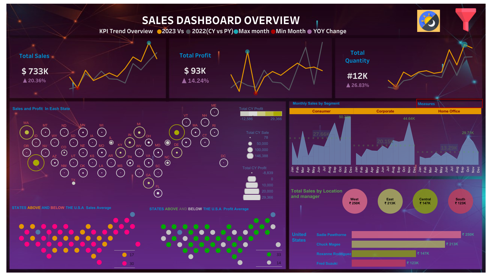

# Sales Dashboard Overview

Welcome to the Sales Dashboard repository! This Tableau dashboard offers an insightful analysis of our sales performance across various metrics, providing stakeholders with key trends and actionable insights.

## Dashboard Features

### KPI Trend Overview
- **Total Sales**: $733K (↑ 20.36%)
- **Total Profit**: $93K (↓ 14.24%)
- **Total Quantity**: 12K (↑ 26.83%)

### Sales and Profit in Each State
- Visual representation of sales and profit by state.
- Color-coded circles indicate performance relative to the U.S. average.

### Monthly Sales by Segment
- Breakdown of sales by Consumer, Corporate, and Home Office segments.
- Visual comparison of monthly sales trends.

### Total Sales by Location and Manager
- Aggregated sales figures for West, East, Central, and South regions.
- Performance metrics for individual sales managers in each region.

## Files

- `Sales-Tableau-Dashboard.png`: Screenshot of the sales dashboard.

## Description

This dashboard provides a comprehensive overview of our sales performance. It includes key performance indicators (KPIs), a state-by-state sales and profit analysis, monthly sales breakdown by segment, and detailed sales figures by location and manager. The visualizations help identify trends and make informed business decisions.

## Online Access

You can also view the dashboard online on Tableau Public: [Sales Dashboard on Tableau Public](https://public.tableau.com/app/profile/disha.yadav/viz/SalesDashboardProject_17071683876730/SalesDashboard)

## Contact

For questions or feedback, please contact dishayadav9728@gmail.com

